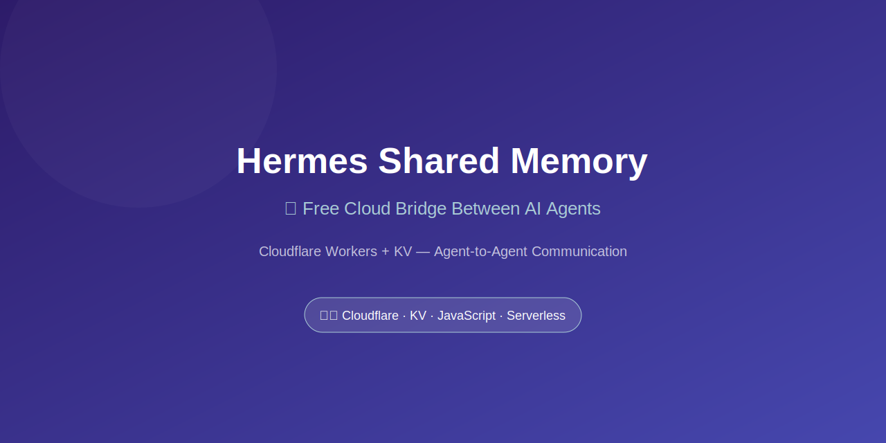

<picture><source media="(prefers-color-scheme: dark)" srcset=".github/banner.svg"></picture>\n\n# 🧠 Hermes Shared Memory

A free cloud bridge between AI Agents — Cloudflare Workers + KV

[](https://github.com/Arefmtl/hermes-shared-memory-/packages)
[](https://github.com/Arefmtl/hermes-shared-memory-/releases/tag/v1.0.0)
[](LICENSE)
[](https://workers.cloudflare.com)
[](https://github.com/Arefmtl/hermes-shared-memory-)
[](https://hermes.nousresearch.com)
[](https://workers.cloudflare.com)

---

## 🤔 Why?

If you run **Hermes Agent** on multiple devices (laptop + Android), each agent has **isolated memory**. They don't know what happened on the other device.

**Hermes Shared Memory** solves this with a free, serverless bridge.

## ✨ Features

- ✅ **Read/Write** any JSON data
- ✅ **Merge updates** without data loss
- ✅ **Auto-sync** every hour (cron job)
- ✅ **100% Free** (100K requests/day on Cloudflare)
- ✅ **Works everywhere** — Termux, Linux, macOS, Windows

## 🚀 Quick Start

### 1. Deploy to Cloudflare

```bash
# Clone
git clone https://github.com/Arefmtl/hermes-shared-memory-.git
cd hermes-shared-memory-

# Install wrangler
npm install -g wrangler

# Login to Cloudflare
wrangler login

# Create KV namespace
wrangler kv:namespace create SHARED_MEMORY

# Update wrangler.toml with the KV namespace ID

# Deploy
wrangler deploy
```

### 2. Set Environment Variables

```bash
export CF_MEMORY_URL=https://your-worker.workers.dev
export CF_MEMORY_TOKEN=your-secret-token
```

### 3. Use It

```bash
# Set a value
python3 cf_shared_memory.py set user/name '{"value": "Aref"}'

# Get a value
python3 cf_shared_memory.py get user/name

# List all keys
python3 cf_shared_memory.py list

# Check status
python3 cf_shared_memory.py status
```

## 📦 Install from GitHub Packages

```bash
npm install @arefmtl/hermes-shared-memory --registry https://npm.pkg.github.com
```

## 🏗️ Architecture

```
┌─────────────────────────────────────────────┐
│              Cloudflare KV                  │
│         (Shared Memory Storage)             │
└──────────────────┬──────────────────────────┘
                   │
        ┌──────────┴──────────┐
        │                     │
   ┌─────────┐          ┌─────────┐
   │ Device A│          │ Device B│
   │ (Mobile)│          │ (Laptop)│
   └─────────┘          └─────────┘
```

## 🔧 API Reference

### Commands

| Command | Description |
|---------|-------------|
| `set <key> <json>` | Store a value |
| `get <key>` | Retrieve a value |
| `patch <key> <json>` | Merge with existing value |
| `delete <key>` | Remove a key |
| `list [--prefix X]` | List all keys |
| `status` | Check service status |

### Examples

```bash
# Store user profile
python3 cf_shared_memory.py set profile '{"name": "Aref", "lang": "fa"}'

# Store with file
python3 cf_shared_memory.py set data/config @config.json

# Merge updates
python3 cf_shared_memory.py patch profile '{"lang": "de"}'

# List with prefix
python3 cf_shared_memory.py list --prefix user/
```

## 🔄 Auto-Sync (Cron Job)

Set up hourly sync between local and cloud:

```bash
# Every hour
0 * * * * ~/.hermes/scripts/sync-shared-memory.sh
```

## 🛠️ Self-Host

```bash
# Requirements
- Node.js 18+
- Python 3.10+
- Cloudflare account (free)

# Setup
git clone https://github.com/Arefmtl/hermes-shared-memory-.git
cd hermes-shared-memory-
npm install
npm run deploy
```

## 📋 Environment Variables

| Variable | Description | Required |
|----------|-------------|----------|
| `CF_MEMORY_URL` | Worker URL | ✅ |
| `CF_MEMORY_TOKEN` | API Token | ✅ |

## 🤝 Contributing

Contributions are welcome! Please open an issue or PR.

## 📄 License

[MIT](LICENSE) — Free to use, modify, and distribute.

## 🔗 Links

- [GitHub Repo](https://github.com/Arefmtl/hermes-shared-memory-)
- [Releases](https://github.com/Arefmtl/hermes-shared-memory-/releases)
- [Packages](https://github.com/Arefmtl/hermes-shared-memory-/packages)
- [Cloudflare Workers](https://workers.cloudflare.com)
- [Hermes Agent](https://hermes.nousresearch.com)

---

**Built with ❤️ for the AI community**

**#HermesAgent #Cloudflare #AI #OpenSource #Serverless #TechInnovation**